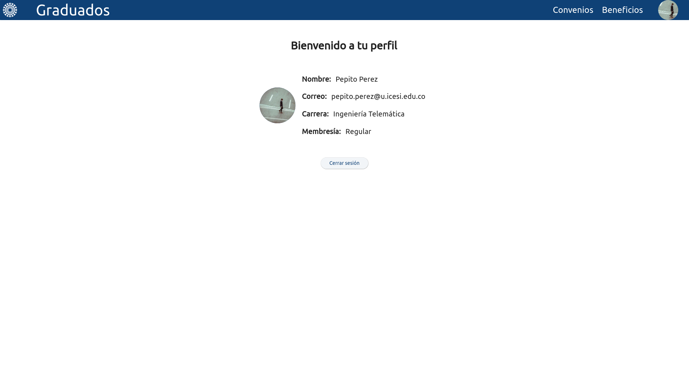
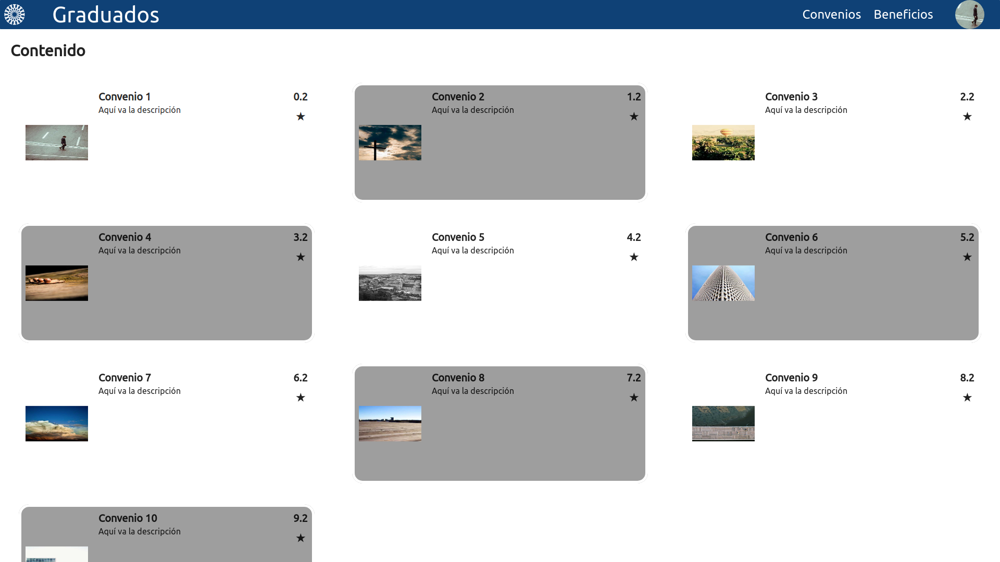
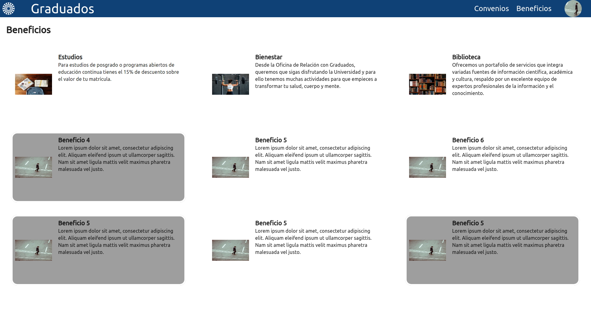
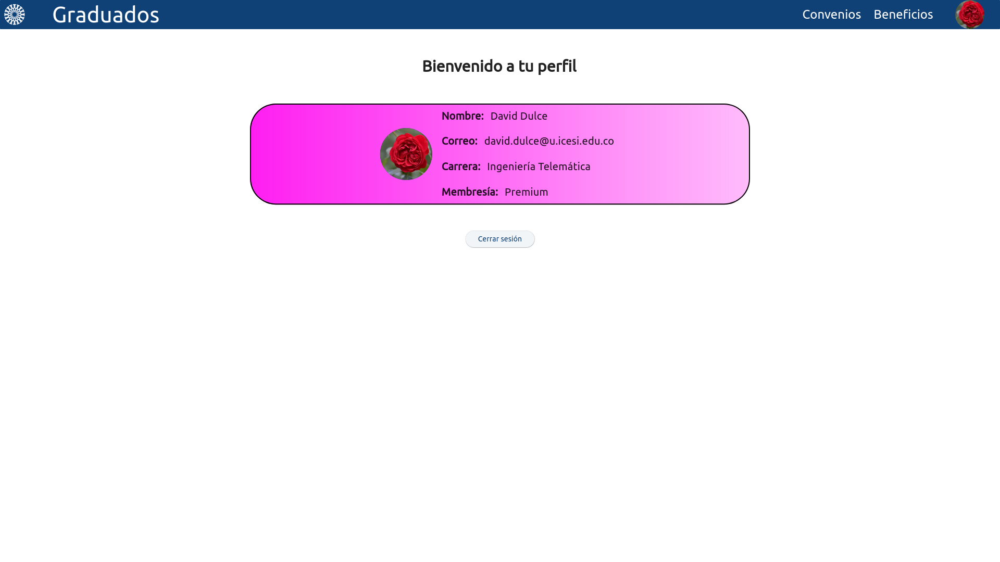
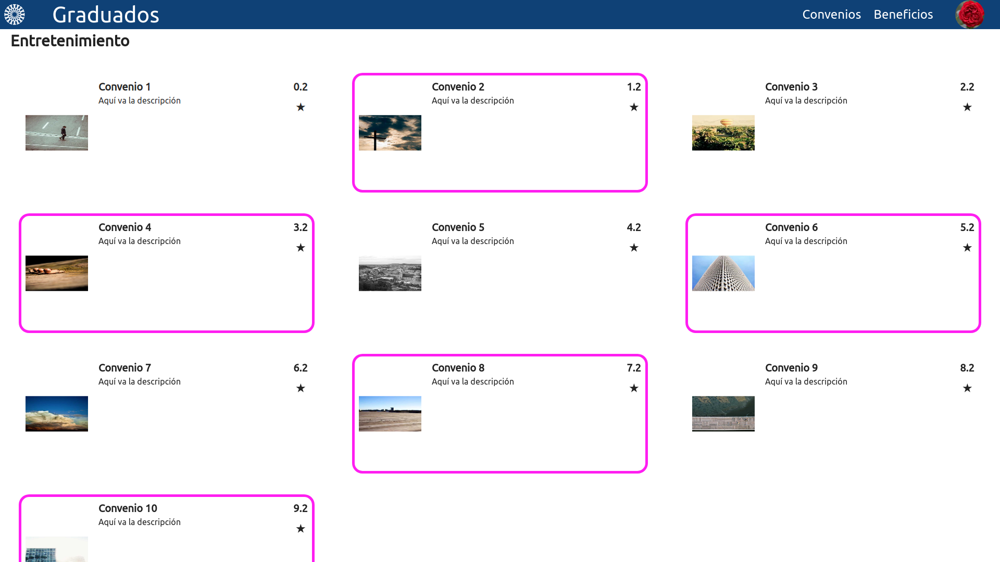
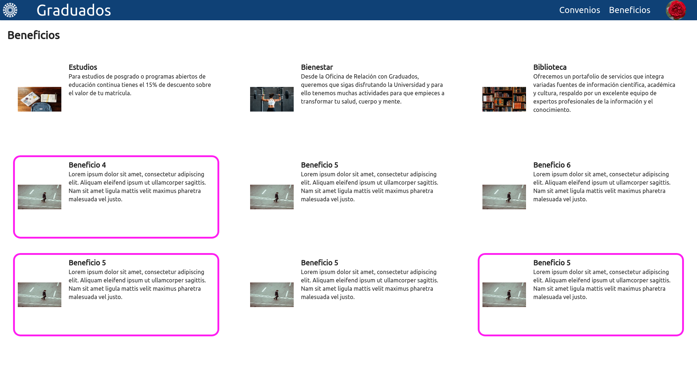

# graduados-icesi

Mockup para el módulo de convenios y beneficios de la universidad ICESI hecho en flutter de acuerdo a los convenios elicitados en la clase de Ingeniería de Software II.

## Getting Started

- [Flutter](https://flutter.dev/docs/get-started/install) (configurado para web)

## Running the app

```bash

# Clone this repository
$ git clone https://github.com/Arkantrust/graduados-icesi.git

# Go into the repository
$ cd graduados-icesi

# Run the app
$ flutter run -d chrome

# Build the app
$ flutter build web

# Start an http server
$ cd build/web && python -m http.server 8000
```

## Screenshots

### Home


### Login


### Usuario regular

#### Perfil


#### Convenios


#### Beneficios


### Usuario premium


#### Perfil


#### Convenios


#### Beneficios


